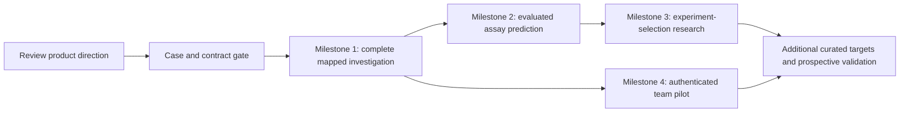

# Signal-1 implementation roadmap

**Status: proposed only — 13 September 2026.** No product code, package manifest, lockfile, data artifact or model has been changed by this revamp task. Approval of the direction is still separate from executing this roadmap.

This plan implements the [mechanism investigation proposal](upgrade-proposal.md), addressing [audit findings A01–A15](repository-audit.md). It aims for a complete, scientifically honest first workflow, then expands only when evidence supports the added complexity.

## Delivery assumptions and gates

Estimates are rough **person-weeks of engineering/scientific development**, not calendar commitments. They assume one strong full-stack/scientific engineer, part-time structural/assay review, and design/QA support. Availability of that reviewer is unconfirmed. The ranges are intentionally wide; unfamiliar mappings, raw assay cleanup and model evaluation can exceed them. No GPU budget, paid API or laboratory work is included in these estimates.

The current Next app is small and builds successfully. Retain its stack and preserve the original baseline as a reference. Every release should include real data behavior, useful interaction, state/error handling and verification together. Do not complete a visual redesign first and defer its scientific meaning to a later phase.

| Phase | Intended outcome | Dependencies | Effort / uncertainty |
|---|---|---|---|
| Case and contract gate | Exact first question, usable data and approved comparison scope | Direction review; available domain reviewer | 1–2 person-weeks; medium/high uncertainty in assay details |
| **M1: complete mapped investigation** | Question → valid linked 3D/evidence analysis → selected panel → saved/reopened brief | Frozen case pack, schema and interaction specification | 4–7 person-weeks; medium/high integration uncertainty |
| M2: evaluated assay prediction | Reproducible baseline ladder and a usable, bounded prediction module | M1 reference/mapping contracts; curated assay scores and splits | 4–8 person-weeks; high scientific uncertainty |
| M3: experiment-selection and mechanism research | Compare panel policies and, if justified, mechanistic inference | M2 calibrated/qualified predictions; adequate original measurements | 6–12 person-weeks; very high, with explicit stop conditions |
| M4: authenticated team pilot | Private shared investigations, review, permissions and operational recovery | M1 durable state; genuine team need | 3–6 person-weeks; medium uncertainty; may proceed alongside M2/M3 after approval |
| Expansion / prospective loop | Additional targets and real experimental outcome evaluation | Evidence of usefulness, rights and research partner | Estimate only after pilot evidence; experimental time/cost separate |

These are not additive calendar dates: curation and expert feedback determine the critical path. M3 is a research option, not a guaranteed successful model deliverable.

## Case and contract gate

The default candidate is the KRAS paired abundance/DARPin K55 case. Its 188-residue reference exactly matched `P01116-2` in the audit, while displayed `P01116-1` has 189 residues. The [saved reference check](kras-reference-check.json) supports the case selection; it does not establish score quality or structural comparability.

Produce a short case specification containing:

- The research question, two or three competing explanations, the measurable outcomes and a clearly bounded decision. State why a variant panel would help and which orthogonal controls would be required.
- Frozen original assay and benchmark identifiers; raw/processed versions and checksums; reuse terms; exact reference sequence; overlapping variant counts; missingness, measurement uncertainty and mutation-class audit. Reconcile the inconsistent preprint DOI suffixes in reference metadata with the original study.
- Two actual structure/chain/assembly choices that support a valid comparison for the question. Verify construct sequences, mapped coverage, additional mutations, ligands and experimental/prediction origin. Record exclusions. No pair has yet been selected or verified in this planning task.
- A small manually reviewed mapping set, including the KRAS isoform difference, unresolved residues, author/label numbering, insertion codes, repeated chains and an unavailable mutant. Include EGFR/L858R with 1IVO as a known wrong-coverage case.
- An interaction specification for the recommended warm workspace: desktop and narrow layouts, linked selection, comparison scope, partial source failures, pending jobs and a complete brief. This is future design work, not a prototype built in this task.

**Gate:** a reviewer can explain what the assays measure, which structures are relevant, why the chosen reference is correct and what a useful panel would test. If KRAS fails on overlap, measurement quality, rights or researcher value, select a better bounded case before building the predictor. Do not quietly replace missing evidence with synthetic biological results. Synthetic fixtures remain restricted to software fault/geometry tests.

## Milestone 1 — One complete, mapped investigation

The first deliverable should feel like the intended product. A researcher creates a question, confirms exact identity, explores measured assay evidence and an appropriate structure comparison, chooses a panel with controls, writes a finding, saves, restarts, reopens and exports it.

**Included:** one curated target/assay setting; supported amino-acid substitutions; a valid mapped structure comparison; linked sequence/3D/table/plot selection; confidence and coverage states; durable local single-researcher investigations; deterministic structural jobs; one correctly labelled published baseline output or supported inference job; a researcher-selected panel and a reproducible brief.

**Deferred:** training a new model, genomic variant interpretation, broad protein-family transfer, compound design/docking, new AlphaFold runs, interactive molecular morphs, autonomous experiment submission, public deployment and simultaneous collaborative editing. A complete first milestone does not need these to be useful.

### Proposed work packages

| Package | Work and purpose | Dependencies / verification |
|---|---|---|
| Identity and evidence | Replace gene-only state with sequence/reference IDs. Correct UniProt parsing; validate variants; preserve per-source status, record identity and provenance. Add snapshot import and partial-source recovery | Case specification; contract fixtures including observed UniProt field value and GraphQL errors |
| Durable investigation | Add PostgreSQL revisions, asset hashes, finding/panel records and autosave. Establish local asset storage with an object-store-compatible interface | Schema; save/restart/reopen and integrity checks |
| Mapping and comparison | Import reviewed SIFTS/construct mappings; resolve chain/assembly; calculate/store correspondence, fit transform, RMSD/coverage/profile and exclusions | Approved structure pair; independent numerical checks and invalid-pair cases |
| Stable molecular stage | Pin/bundle Mol*. Own plugin lifecycle, cancellation and state updates. Connect typed selections to sequence and evidence; implement one overlay and one side-by-side comparison mode | Mapping contract; visual/browser, keyboard and repeated-scene checks |
| Evidence and confidence | Show measured paired outcomes, variant table, structural coverage and optional pLDDT/PAE with correct missingness. Keep two assay scales distinct | Verified measured data; mapping tests; valid/partial/malformed confidence cases |
| Jobs and prior-model output | Add durable job lifecycle for structural computation and a small baseline import/inference task. Label prior-model scores with checkpoint/source and applicability; reject stale results | Input hashing and artifact schema; kill/retry/cancel tests; baseline provenance check |
| Finding, panel and brief | Capture a selected region with evidence; author supporting/conflicting findings; choose candidates and controls; export report + JSON/CSV manifest + supported molecular scene | All above; complete task and fresh-process recovery |

The integration should replace the current score and false comparison modes as the new scientific contracts become available. Do not leave a “High Actionability” score beside the new uncertainty views. Retain useful legacy dossier/export concepts without migrating its unsupported rankings as scientific results.

### Testable exit criteria

These are proposed release gates. No criterion below is claimed to pass today.

| ID | Criterion | Required evidence |
|---|---|---|
| M1.1 | A fresh investigation has a question and exact taxon/accession/isoform/sequence hash; the KRAS case resolves to the assay sequence, not merely the current canonical entry | Contract fixture and saved manifest; independent sequence equality check |
| M1.2 | Wrong reference amino acids, invalid positions, ambiguous mappings and unsupported mutation classes are rejected with useful diagnostics; no silent renumbering | Positive and negative cases including boundary indices and insertion/isoform scenarios |
| M1.3 | Every residue in a reviewed gold set of at least 30 mapping cases maps correctly or is explicitly unresolved; include at least six classes of edge case | Expert-reviewed expected mapping table with identifiers and provenance; 100% correctness on that release gate, not a population accuracy claim |
| M1.4 | Same-structure aliases, disjoint coverage and missing mutant structures never produce a labelled WT/mutant comparison | Fault cases and visible unavailable-state captures; EGFR/1IVO must fail coverage for L858R |
| M1.5 | The supported comparison records atom correspondence, fit/evaluation masks, transform, count, coverage, units and exclusions | Synthetic rigid-transform control within 0.001 Å RMSD of zero; independent implementation agrees within a declared numerical tolerance on the real pair; degenerate fits rejected |
| M1.6 | Selecting a residue or variant in 3D, sequence, table or assay plot highlights the same reference identity in every linked view | Browser interaction recording and automated identity assertions; keyboard path covers the same operation |
| M1.7 | Confidence values stay attached to their model version; missing values never become zero confidence/error; partial and stale jobs cannot overwrite a newer investigation | Out-of-order, one-URL-missing, malformed payload and cancellation tests; per-residue/matrix dimensions checked |
| M1.8 | A measured assay value, curated annotation, computed structure statistic, model prediction and researcher claim are visibly distinguishable and traceable | Inspect 20 representative values/findings; each opens its correct evidence/provenance record |
| M1.9 | A researcher creates a panel with controls, writes expected observations and contradictory evidence, and produces a readable brief | Complete case artifact reviewed by the domain reviewer; no unsupported therapeutic conclusion |
| M1.10 | Restarting the application recovers exact reference, evidence, selections, camera, findings and panel. Export/import reconstructs required assets and checksums | Fresh-process round trip, missing-asset detection, and a reproducibility manifest comparison |
| M1.11 | Killed/retried jobs finalize once, cancellation is visible, and a provider outage retains the last valid local investigation | Fault injection, idempotency record and recovery log; no dependency on optional Redis for correctness |
| M1.12 | Core controls have names and visible focus; keyboard users can select a variant, inspect evidence, add a finding and export; reduced motion and 200% zoom work | Browser screenshots at agreed desktop/narrow widths, keyboard walkthrough and screen-reader spot check; no unsupported full compliance claim |
| M1.13 | Viewer, worker and WebGL resource counts return to baseline after 20 open/compare/close cycles; no unbounded growth after warm-up | Instrumented lifecycle log. Measure supported-workload selection latency, cached reopening and camera frame rate against proposal budgets |
| M1.14 | Prior-model output identifies its model/source/version and supported reference; it is never presented as a newly trained Signal-1 result | Baseline manifest and comparison to known published/reference scores or reproducible small inference output |
| M1.15 | Build, type checks, lint, scientific unit tests, adapter contract tests and the complete save/reopen workflow run in CI | Release report with dependency/runtime versions and captured evidence |

M1 is complete only when the integrated task passes, not when these packages each have a demo. If live AlphaFold/Open Targets access is still blocked, a clearly dated permissible reference snapshot can support the case; the UI must show that mode, and the release must not claim verified live-provider coverage.

## Milestone 2 — A scientifically evaluated prediction module

Implement the B0–B3 baseline ladder from the proposal: naive/one-hot baselines, a relevant sequence-based score, frozen representations with a regularized head, and explicit structure-feature ablations. Evaluate on the chosen assay task before expanding to other proteins. Add a published structure-aware comparator if its license, runtime and coverage permit it. Use cached frozen embeddings initially; do not begin with foundation-model pretraining or expensive fine-tuning.

Pre-register prediction targets, split manifests, hyperparameter budget, metrics, uncertainty assessment, structure-coverage policy and a smallest practically useful improvement with the domain reviewer. Fit normalization, imputation, embeddings-derived projections and calibration only on allowed training/calibration data. Keep paired outcomes and replicates for a held-out variant together. Maintain both random and harder position/background splits, clearly naming each claim.

**Exit criteria:** reproduce baseline scores on a small known case; publish learning curves and paired comparisons with uncertainty; report all attempted methods, eligibility/missingness and run cost; demonstrate no split overlap; retain a locked test manifest; integrate the best supported model into the actual investigation with applicability/abstention. A new head ships as the default only if its prespecified benefit is supported. If no new model improves on the best simple baseline, deliver the reproducible negative result and keep the stronger baseline—the milestone still produces a defensible evaluation module.

Model metrics are not a usability result. Conduct the first formative study of approximately five to eight relevant researchers on matched tasks and examine unsupported claims, mapping errors, time to brief and recovery. No participants have been contacted. If the workflow does not improve investigation quality or practical completion, revise the interaction or product focus before more ambitious model work.

## Milestone 3 — Experimental selection and mechanistic depth

Start with transparent panel filters and random/diversity/greedy baselines. Evaluate uncertainty-aware selection on the same hidden-label libraries, initial measurements and batch budgets. Include controls, repeats and feasibility constraints in the budget. Distinguish recovering desired outcomes from learning the landscape and testing a hypothesis.

If original paired measurements and experimental design support it, reproduce a MoCHI-style model before adapting it. Keep measured phenotype, inferred latent trait and predicted phenotype distinct. Check parameter identifiability, noise/replicate assumptions, residuals, calibration, sensitivity to initialization and generalization to held-out backgrounds or replicates. Do not infer free energy by subtracting normalized assay scores.

**Exit criteria:** the selection policy is reproducible, beats or fails to beat the declared baselines with appropriately qualified uncertainty, and visibly explains tradeoffs in the panel editor. Mechanistic labels require a reproduced measurement model and domain review. Stop the custom model track if improvement is unstable, structure adds only missingness bias, uncertainty is uninformative, or raw measurements cannot support identifiable traits. Preserve useful negative findings.

A prospective experimental round is a separate collaboration and budget decision. It could test whether proposed variants and controls discriminate the chosen explanations. Retrospective benchmark gains alone do not permit a claim of fewer real-world experiments or new therapeutic mechanisms.

## Milestone 4 — A reliable team pilot

Only after a complete single-researcher workflow is useful, introduce authenticated projects, owner/editor/reviewer roles, authorized artifact downloads, share expiry/revocation and audit history. Replace room-name authority with server-enforced membership. Broadcast durable entity revisions; add late-join/reconnect reconciliation and user-visible edit conflicts. Residue-based presence is more meaningful than screen cursors when views differ.

Add backup/restore rehearsal, per-source observability, job resource limits, queue depth/error dashboards, rate limits and export attribution. Do not reuse the current default public room behavior. Select hosting based on the actual Python/job/object-storage requirements; the current Socket.IO server pattern must not be assumed to work unchanged on a serverless deployment.

**Exit criteria:** cross-project read/write tests fail correctly, revoked links stop access, two users reopen the same scientific state, worker/server interruption is recoverable, and a backup restores the case. Deployment and any paid services require the user's later authorization; this planning task has initiated neither.

## Proposed repository evolution

| Current area | Proposed responsibility after implementation |
|---|---|
| `src/components/workbench.tsx` | Small workspace composition plus feature-specific state/controllers; remove unvalidated triage score |
| `src/components/molstar-viewer.tsx` | Versioned lifecycle/selection/scene adapter; narrow typed API |
| `src/components/therapy-graph.tsx` | Replace default star with indication/evidence table and drilldown; retain graphs only for a defined relationship question |
| `src/app/api/resolve/route.ts` | Thin request orchestration over validated provider and identity modules |
| `src/app/api/story/route.ts` | Migrate toward durable investigation/scene revisions and typed import/export; do not treat event arrays as full state |
| `src/pages/api/socket.ts` | Later authenticated revision/presence channel; not storage or authorization source |
| `src/lib/types.ts`, `http.ts`, `cache.ts` | Versioned domain contracts, per-provider outcomes, deadlines/retries, bounded optional caches |
| `public/workers/confidence.worker.js` | Typed, versioned browser processing with dimension/missingness checks; scientific jobs live outside this worker |
| New scientific worker area | Pinned Python environment, structure mapping/comparison, baseline inference, evaluation manifests and jobs |
| New persistence/test areas | Database migrations, snapshot/export schemas, contract fixtures, numerical tests, UI workflows and CI |
| `legacy-static/` | Preserve as historical reference; document which dossier concepts were recovered. Any later removal is a separate migration decision |

These are responsibilities, not a demand for a monorepo or a new framework. Choose exact directory names with the implementer; prefer consistency with the small existing project.

## Risks, stop conditions, and review decisions

| Risk | Earliest check | Response |
|---|---|---|
| Researchers do not need the proposed decision workflow | Case gate and M1 formative tasks | Narrow/reframe the question; do not compensate with more providers |
| KRAS paired data or constructs are unsuitable | Raw/processed curation gate | Choose another well-defined case; retain the identity lessons |
| Comparison metrics are technically valid but scientifically irrelevant | Structure-pair/fit-scope review | Add domain/context constraints or present descriptive results only |
| Structure-aware ML adds no reliable benefit | M2 ablations | Ship the better simple model and preserve negative evidence |
| Mechanistic inference is non-identifiable | M3 diagnostics | Keep paired observations and predictive models; do not label latent energies |
| Live APIs become inaccessible or change | Provider contract tests and fault cases | Use versioned allowed snapshots, explicit stale states and bounded refresh |
| Data/model reuse terms prevent planned redistribution | Before each dataset/checkpoint import | Retain attribution, separate restricted assets, or select permitted alternatives |
| Operational complexity outruns a single-user pilot | M1 architecture and resource measurements | Keep modular application + one worker; defer realtime/team infrastructure |

The meaningful review decisions are the recommended product focus, the first domain question/case, and single-researcher versus team-pilot scope. Suggested defaults are in the proposal. Once those are accepted, estimate the bounded case gate/M1 with an assigned implementer and reviewer, then authorize that work explicitly. The current task ends with these reviewable documents.
