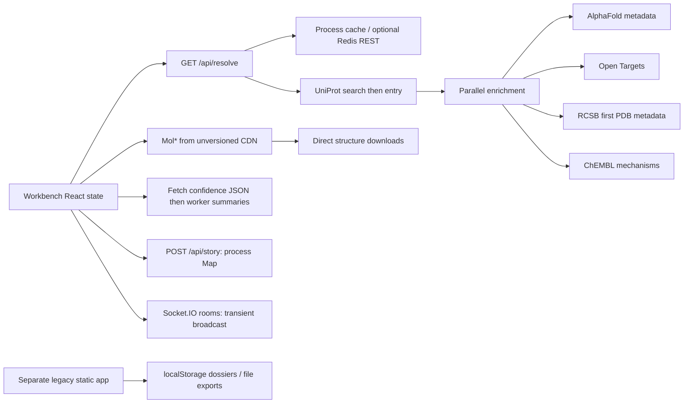

# Signal-1 repository audit

**Audit date:** 13 September 2026. **Baseline:** `a35f831237769746c07c41fb6cffad4079f8e1cc`. **Scope:** audit and proposal only; no product upgrades implemented.

Signal-1 is a small, buildable integration prototype with an attractive intended centre of gravity: understanding a target through its structure. It does not yet deliver a scientifically valid comparison or a reproducible investigation. Its greatest risks are plausible-looking labels attached to unverified biological identities, an unsupported actionability score, and a story that cannot reconstruct the analysis. The current application also loses useful dossier and export functionality present in the older static application.

Read this with [research notes](research-notes.md), the [upgrade proposal](upgrade-proposal.md), and the [proposed roadmap](implementation-roadmap.md). Machine-readable records are in [coverage.json](coverage.json) and [audit-evidence.json](audit-evidence.json).

## Scope, coverage, and evidence standard

The working repository is the project-local `signal-1-workbench` directory specified in the assignment. The Desktop path in the handoff is historical. Parent instructions protect synced `sources/`; none were changed. There are no additional tracked repository instructions, submodules, nested package manifests, CI workflows, migration files, model artifacts, or test suites. The nested `legacy-static/` directory is a separate browser application, not an active Next route.

At the start, Git reported only the untracked `.revamp-context/` handoff directory. The handoff and both preserved evidence snapshots were read, then checked against the actual checkout. There were 28 tracked files. All 25 first-party implementation, documentation, and configuration files were read in full, totalling 4,747 text lines. Generated dependency metadata was inspected as metadata, not represented as a review of its dependencies. Binary content was inventoried. No unavailable first-party source was identified.

| Material | Files / lines | Coverage and purpose |
|---|---:|---|
| `README.md` | 1 / 110 | Full; promises, architecture, stated limitations |
| `.gitignore`, `package.json`, `next.config.ts`, `tsconfig.json`, `eslint.config.mjs`, `postcss.config.mjs` | 6 / 88 | Full; execution, dependencies, build, lint, environment |
| `src/app/layout.tsx`, `page.tsx`, `globals.css` | 3 / 195 | Full; entry point, metadata, styling, layout assumptions |
| `src/components/workbench.tsx`, `molstar-viewer.tsx`, `therapy-graph.tsx` | 3 / 1,160 | Full; interaction, scoring, async state, viewer, graph |
| `src/app/api/resolve/route.ts`, `story/route.ts` | 2 / 606 | Full; all five adapters, pairing, graph, story storage |
| `src/lib/cache.ts`, `http.ts`, `types.ts`, `utils.ts` | 4 / 205 | Full; cache, HTTP semantics, identity and event contracts |
| `src/pages/api/socket.ts`, `src/types/socket.ts` | 2 / 58 | Full; realtime transport and server lifecycle |
| `public/workers/confidence.worker.js` | 1 / 115 | Full plus isolated execution; confidence processing |
| `legacy-static/app.js`, `index.html`, `styles.css` | 3 / 2,210 | Full; dossier, batch, compare, persistence, export, scoring, layout |
| `next-env.d.ts` | 1 / 7 | Generated; fully read |
| `package-lock.json` | 1 / 6,854 | Generated; root, resolved versions, registry/integrity/license metadata inspected; 452 package entries including root; not a dependency security audit |
| `public/favicon.ico` | 1 binary | Inventoried and hashed; not visually reviewed |
| `.revamp-context/HANDOFF.md`, `evidence.json` | 2 untracked references | Fully read; historical evidence distinguished from current observations |
| Installed dependencies and generated `.next` output | Temporary audit copy only | Used for checks; vendor implementation and generated bundles not comprehensively reviewed |

**Evidence labels used below:** **source-confirmed** means a directly traceable implementation fact; **reproduced** means an isolated probe or API call demonstrated it; **risk** means a consequence that still needs runtime or user validation. Passing static checks is not scientific or product validation.

## Current architecture and workflow

1. The user enters a gene; the application assumes reviewed human UniProt entries and takes the first search result. A second entry fetch provides canonical symbol and sequence length. The actual sequence, taxon, sequence version, and chain mapping are absent from the returned contract.
2. Enrichment waits for four requests together. RCSB lookup covers only the first PDB reference. The resolver returns a small set of labels and identifiers; chain coverage, ligand context, construct mutations, assembly and experimental conditions are discarded.
3. Compare mode selects defaults by identifier prefix. Mol* creates a fresh viewer and loads deduplicated selected structures sequentially. The application supplies no correspondence, fitted transform, comparison result, or mapped residue interaction.
4. Confidence documents are fetched by the browser for the resolved target, not for an explicit selected model version. The worker reduces them to scalar summaries. Annotation inputs create independent text records.
5. Graph clicks set a label and append an event. Story playback changes a highlighted event index. Sharing stores event arrays in server memory or embeds them in a URL. Loading a shared story replaces the event list, not the target, scene or annotations.

The legacy application instead fetches three providers directly from the browser, builds dossiers, ranks up to ten genes, saves up to 100 dossiers in localStorage, and exports JSON/Markdown. It has no molecular viewer or defensible learning system. Its context note appears in text but does not condition retrieval or ranking.

## Findings that should determine the revamp

### A01 — Compare labels do not establish the claimed comparison

**Priority: foundational. Source-confirmed and reproduced.** `buildDefaultPair` selects canonical/PDB/isoform by availability. WT/mutant can mean canonical AlphaFold versus the first PDB entry, with no mutant check. A one-candidate target yields the same structure on both sides, which the selected-structure deduplication reduces to one load. Isoform mode can silently substitute PDB. Mutation input only generates a sentence such as “Residue 858 changes L -> R”; it never changes coordinates, finds mutant structures, or checks reference sequence.

Evidence: [workbench lines 57–100, 152–160, 538–552][workbench]. Isolated extraction of the actual functions reproduced WT/mutant → AlphaFold/PDB and the same-structure fallback. This is not evidence that a particular PDB entry is wild type or mutant; it proves the program does not know.

**Implication:** availability must be a typed result. Comparison should be enabled only after reference identity, sequence differences and residue coverage are established. “Mutant structure unavailable” is a useful outcome.

### A02 — The default EGFR structure does not cover the default mutation

**Priority: foundational. Reproduced against live data.** The resolver selected `1IVO` first. UniProt reported chains A/B mapping to positions 25–646; the application defaults to `L858R`. Thus its first structure does not contain the target position. The next candidates, `1M14` and `1M17`, have reported coverage 695–1022, but the resolver ignores these cross-reference properties. RCSB describes [1IVO as an extracellular-domain complex](https://www.rcsb.org/structure/1IVO).

Evidence: [resolver lines 221–225, 396–413, 490–497][resolve], [workbench lines 104–106][workbench], and saved live probes. The audit did not independently map coordinate residues or assess these structures as valid mutant comparators.

**Implication:** choose structures by question and mapped coverage, with a visible exclusion reason, rather than by upstream list order.

### A03 — Isoform discovery uses the wrong UniProt comment value

**Priority: high. Source-confirmed and live-schema-confirmed.** The code searches for `ALTERNATIVE_PRODUCTS`; EGFR's actual response uses `ALTERNATIVE PRODUCTS`. Four isoforms were present in the live entry but none appeared in resolver candidates. Even after that parser is corrected, the first listed isoform was `P00533-1`, marked `Displayed`; choosing it does not demonstrate a distinct isoform sequence. The candidate builder also assumes an AlphaFold model exists for the isoform without querying it.

Evidence: [resolver lines 267–280 and 480–487][resolve], `additional_probes` in the evidence file. Isoform model availability remained unverified because AlphaFold requests were blocked with HTTP 403 in this environment.

### A04 — “Actionability” is an unsupported and selection-sensitive number

**Priority: foundational. Source-confirmed and reproduced.** The formula is `100 × (0.45 × top disease score + 0.35 × first drug phase / 4 + 0.20 × structure term)`. The structure term is 1 if a selected structure is AlphaFold and 0.6 otherwise, even with no selected structure. On identical synthetic disease/drug evidence, choosing AlphaFold rather than PDB changed 83 to 91. No disease indication, modality, assay context, calibration, outcome label, training procedure or empirical validation defines this score.

Evidence: [workbench lines 34–43 and 162–174][workbench]. “High Actionability” combines evidence for potentially different diseases and gives a predicted-structure source an automatic bonus. Missing evidence becomes zero. The initial unloaded state shows zero/Exploratory in source. The live partial EGFR response would compute 47 from drug phase 4 and the PDB term; that is a code-derived calculation, not a visual observation.

**Implication:** remove the composite verdict. Expose evidence dimensions and separately named, evaluated assay predictions. Researcher-selected experiment priorities must record the objective and constraints.

### A05 — Loading two structures is not an implemented scientific comparison

**Priority: foundational. Source-confirmed.** The viewer wrapper calls load methods but no alignment, superposition, chain matching, coordinate transform or quantitative difference calculation. The application has no result contract for fit scope, RMSD, local displacement, matched residues, or uncertainty. “Left” and “right” are inputs to one viewer; the wrapper does not implement two synchronized viewports.

Evidence: [viewer lines 64–80 and 100–149][viewer], [types lines 12–21][types]. Mol* itself has native selection and superposition capabilities; their existence must not be confused with a verified application workflow. No browser session was available to inspect its built-in controls here.

### A06 — Residue annotations are disconnected from biological identity and 3D

**Priority: foundational. Source-confirmed.** An annotation contains an arbitrary positive finite number, optional chain, label and author. Decimal and out-of-range values are accepted. The form does not set chain; there is no target, accession, isoform, structure, assembly, insertion code or mapping identifier. Annotations are never passed into the Mol* wrapper, and the wrapper has no residue-selection callback. Switching target clears local annotations; remote annotations are appended without checking target.

Evidence: [types lines 80–88][types], [workbench lines 223–225, 364–375, 447–475, 678–682, 784–819][workbench]. A future linked view requires a stable residue-selection contract shared by the sequence, viewer, evidence and notebook.

### A07 — Confidence is global, weakly validated, and can become stale

**Priority: high. Source-confirmed; parser edge cases reproduced.** Both pLDDT and PAE URLs are required even when one useful measure could be shown. Browser JSON fetches do not check HTTP status. Worker messages lack target/model/job identifiers, so an older result can overwrite a newer selection. On a target lacking confidence URLs, the branch clears values without clearing `confidenceLoading`. There is no worker error handler. The worker returns zeros for empty payloads, accepts out-of-range pLDDT and drops nonfinite values without retaining residue indices. The assay probe `[95, null, 45]` became two residues with mean 70; `[120, -2]` was accepted.

Evidence: [workbench lines 291–326 and 741–776][workbench], [worker lines 1–115][worker]. JSON parsing itself occurs before the worker; the worker handles reduction, not the complete download/parse workload. Global PAE mean/max also suppress directional and domain-specific information. No latency benchmark was performed.

### A08 — Viewer lifecycle and asset provenance need explicit ownership

**Priority: high. Source-confirmed; memory impact not measured.** CSS and script URLs have no pinned version. The resolved `modelUrl` is discarded when the loader re-fetches AlphaFold by accession. Each scene change replaces the DOM and creates another viewer. Cleanup only sets a boolean; it never invokes disposal, including when creation finishes after cancellation. Loading can continue after cancellation. A rejected script promise remains cached, so a scene reload does not reset asset acquisition.

Evidence: [viewer lines 30–61, 64–67, 100–149][viewer]. This creates a resource leak and stale-callback risk; no measured heap growth, frame rate or WebGL-context count is claimed. The build's small initial bundle excludes dynamically downloaded Mol* and molecular data.

### A09 — Stories cannot reproduce an investigation

**Priority: foundational. Source-confirmed.** Server storage is process-local. Events contain labels or partial payloads, not immutable evidence snapshots and full state. Direct structure-select changes do not append comparison events. Model/camera selection is unrecorded. `structures-loaded` is recorded when reload is requested, before completion. Playback only increments `playbackIndex`; importing events does not replay actions. The fallback URL has no size/privacy boundary and is also event-only.

Evidence: [story route lines 5–46][story], [workbench lines 187–201, 263–289, 407–425, 479–508, 527–535, 633–671, 857–865][workbench]. Same-process save/read worked in the audit. Loss after restart follows directly from storage design; it was not separately reproduced by a restart.

### A10 — Shared rooms lack membership enforcement and annotation context

**Priority: high before multi-user use. Reproduced locally with two synthetic clients.** The server relays an annotation to `payload.roomId` without requiring the sender to have joined that room. User identifiers are client-supplied. Every fresh application defaults to `default-room`. There is no room ownership, access control, durable annotation state, late-join replay or conflict handling.

Evidence: [socket lines 11–39][socket], [workbench lines 133–145 and 328–386][workbench]. A test client that never joined `audit-only-room` successfully sent an annotation to a receiver in that room. This probe used only the isolated audit server. Screen-normalized cursors can also point at different residues when collaborators have different cameras; that is a design risk, not a tested incident.

### A11 — Adapter failure and provenance contracts lose meaning

**Priority: high. Source-confirmed and partly reproduced.** GraphQL `errors` in a successful HTTP response are ignored, becoming empty disease/drug arrays; an extracted-function fixture confirmed this. RCSB and ChEMBL exceptions become silent empty results. Missing Ensembl mapping and true no-results are not distinct. A single slow request delays all enrichment; HTTP helpers have no timeout, cancellation, retry budget or runtime schema validation. Zod is installed but unused in first-party code.

Evidence: [resolver lines 87–101, 330–393, 416–446][resolve], [HTTP helper][http]. Trace strings contain a few identifiers and one timestamp, but omit per-record URLs, release versions, raw response hashes, retrieval status and transformation history. The AlphaFold loader may subsequently retrieve different bytes. Negative/partial responses are cached for ten minutes.

### A12 — Therapy context drops evidence that would explain a decision

**Priority: high. Source-confirmed and live-schema-confirmed.** Open Targets rows retain only disease score/name and drug phase/status. ChEMBL records retain a text mechanism but lose explicit action type, references, direct-interaction and variant fields. The first live mechanism had `max_phase: 4`, so the suspected phase-field absence is **not** a reproduced bug; it had no `pref_name`, so the UI receives a ChEMBL identifier as its name. The API reported 90 mechanisms while the resolver requests 12 and keeps 10.

Evidence: [resolver lines 338–391, 428–446, 503–558][resolve], live probe. Source-aware drug deduplication allows duplicate identifiers across providers in the list, while graph deduplication collapses them without merging provenance. The graph is a target-centred star; it does not encode drug–disease indication or evidence drilldown. Its disease/drug index-zero positions coincide at the top, and labels truncate at 20 characters. These are source-derived layout facts, not captured visual defects.

### A13 — Saved work and end-to-end completion regressed from legacy

**Priority: high. Source-confirmed.** The current app has no durable project list, question, experiment brief, outcome ingestion, or file export. Legacy has localStorage portfolios, structured dossiers, JSON/Markdown downloads, and context notes. Those are useful interaction precedents, although its weighted score and “recommended first-pass pick” are equally unsupported. Loading a saved legacy dossier also rescales it using current settings without retaining a versioned scoring policy.

Evidence: [legacy app lines 251–272, 821–870, 967–993, 1067–1161, 1317–1361][legacy]. Recover the dossier concept; do not restore arbitrary target rankings.

### A14 — UI hierarchy and accessibility need workflow-based verification

**Priority: medium; source-based assessment only.** The cream/green palette is distinctive and coherent; labelled gene, mode and structure controls are a useful start. However, the oversized introductory copy, tall viewer, and long right-side stack compete with the task. Primary status is embedded in the score panel; wording exposes “API adapter layer” and room/user identifiers. The heading references Fraunces and body references IBM Plex Sans, but the Next app never loads those font assets. The legacy HTML does.

Annotation inputs rely on placeholders and the colour input has no accessible label. SVG graph groups have `role="button"` but no tab index or keyboard handler. Current status has no live-region semantics; legacy has `aria-live="polite"`. Minimum viewer height is 560px, with a percentage-height inner container; actual sizing and mobile behavior need browser verification. Contrast ratios, focus order, screen-reader output, overlays, loading states and responsive screenshots were not tested.

Evidence: [workbench lines 560–631, 724–886][workbench], [graph lines 27–40 and 76–103][graph], [styles lines 26–34 and 112–118][styles], [legacy HTML][legacyhtml].

### A15 — Operational boundaries are thin despite passing checks

**Priority: high for a reliable pilot. Source-confirmed.** No tests/CI, API contract fixtures, migrations, backup/restore, durable jobs, scientific environment, model registry or evaluation scripts are tracked. Redis failures can fail resolution: network/JSON errors on `redisGet` are uncaught, and fire-and-forget `redisSet` can reject without handling. Expired map keys are not proactively pruned and concurrent misses are not coalesced. Story POST validates only that the events value is a nonempty array; an invalid event shape was saved and retrieved successfully.

Evidence: [cache lines 1–60][cache], [story lines 17–32][story], inventory. The next lint command is deprecated but passed on the locked Next 15.5.12; the 16.x ESLint-config version is a maintenance mismatch, **not a reproduced build failure**. No repository LICENSE exists; do not describe the repository itself as openly licensed solely because dependencies are open source.

## Runtime and UI status

Checks ran against an exact `git archive HEAD` copy at `/tmp/signal1-audit.4vX3pM`, using Node 22.22.0 and npm 10.9.4. Locked dependencies were installed with lifecycle scripts disabled. The initial sandboxed install encountered DNS restrictions; an approved network-enabled retry succeeded. Original manifests, source and lockfiles were untouched.

| Check | Result | What it establishes / limit |
|---|---|---|
| `npm run typecheck` | Pass | TypeScript compilation, not runtime schemas |
| `npm run lint` | Pass, deprecation notice | Locked Next lint works; migration still advisable |
| Direct ESLint on `src`, worker and legacy app | Pass | No lint diagnostics in those files |
| `NEXT_TELEMETRY_DISABLED=1 npm run build` | Pass | Production compile and prerender succeed |
| Production server on local port 4311 | Started | Existing app can start; not a visual interaction test |
| `GET /api/resolve?gene=EGFR` | HTTP 200, one request ≈2.6s | P00533 / ENSG00000146648; 3 PDB candidates; 10 ChEMBL drugs; no diseases/AlphaFold in this run |
| UniProt, ChEMBL, RCSB | Data returned | Confirms selected source contracts for this example only |
| AlphaFold primary and legacy; Open Targets | HTTP 403 in this environment | Source access failure, not proof of global outage or absent biology |
| Missing query/id | HTTP 400 | Basic route validation works |
| Story POST/readback | HTTP 200, including invalid event object | Same-process storage works; schema too permissive |
| Nonmember socket room send | Delivered | Missing membership enforcement reproduced locally |
| Pair, score, GraphQL, worker probes | Findings A01/A04/A07/A11 reproduced | Actual source functions extracted/transpiled; explicitly synthetic inputs |
| Browser visual/interaction inspection | Blocked | Browser security tool could not verify admin policy; no bypass attempted, no screenshots accepted |

The UI journey is therefore: **1. entry screen — unverified visually; 2. resolve target — partial API success; 3. compare/annotate — source-confirmed scientific gaps, visual interaction unverified; 4. save/reopen — event API works but reconstruction absent; 5. collaboration — synthetic transport works with an access-control defect.** No full UI audit, frame-rate result, accessibility certification or researcher usability result is claimed.

## What to retain and what to replace

Retain Next/React as the application shell, Mol* as the rendering foundation, the five-source integration intent, worker separation for suitable browser computation, the warm restrained visual identity, and the legacy dossier/export concept. Replace the scientific contracts, score, default pairing, story storage and viewer lifecycle. Refactor the 890-line component and 559-line resolver into domains as the new contracts become real; a wholesale framework rewrite would not solve their actual problems.

The next implementation should prove a complete saved investigation with valid mapping and a useful experimental question before adding more model names or data providers.

[workbench]: https://github.com/feeqii/signal-1-workbench/blob/a35f831237769746c07c41fb6cffad4079f8e1cc/src/components/workbench.tsx
[resolve]: https://github.com/feeqii/signal-1-workbench/blob/a35f831237769746c07c41fb6cffad4079f8e1cc/src/app/api/resolve/route.ts
[viewer]: https://github.com/feeqii/signal-1-workbench/blob/a35f831237769746c07c41fb6cffad4079f8e1cc/src/components/molstar-viewer.tsx
[types]: https://github.com/feeqii/signal-1-workbench/blob/a35f831237769746c07c41fb6cffad4079f8e1cc/src/lib/types.ts
[worker]: https://github.com/feeqii/signal-1-workbench/blob/a35f831237769746c07c41fb6cffad4079f8e1cc/public/workers/confidence.worker.js
[story]: https://github.com/feeqii/signal-1-workbench/blob/a35f831237769746c07c41fb6cffad4079f8e1cc/src/app/api/story/route.ts
[socket]: https://github.com/feeqii/signal-1-workbench/blob/a35f831237769746c07c41fb6cffad4079f8e1cc/src/pages/api/socket.ts
[http]: https://github.com/feeqii/signal-1-workbench/blob/a35f831237769746c07c41fb6cffad4079f8e1cc/src/lib/http.ts
[cache]: https://github.com/feeqii/signal-1-workbench/blob/a35f831237769746c07c41fb6cffad4079f8e1cc/src/lib/cache.ts
[graph]: https://github.com/feeqii/signal-1-workbench/blob/a35f831237769746c07c41fb6cffad4079f8e1cc/src/components/therapy-graph.tsx
[styles]: https://github.com/feeqii/signal-1-workbench/blob/a35f831237769746c07c41fb6cffad4079f8e1cc/src/app/globals.css
[legacy]: https://github.com/feeqii/signal-1-workbench/blob/a35f831237769746c07c41fb6cffad4079f8e1cc/legacy-static/app.js
[legacyhtml]: https://github.com/feeqii/signal-1-workbench/blob/a35f831237769746c07c41fb6cffad4079f8e1cc/legacy-static/index.html
