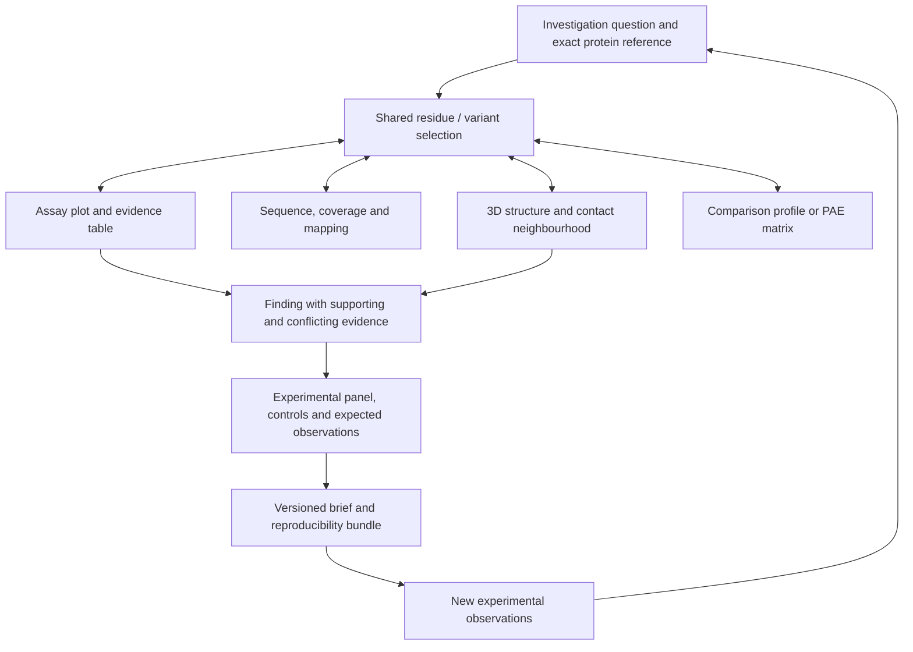
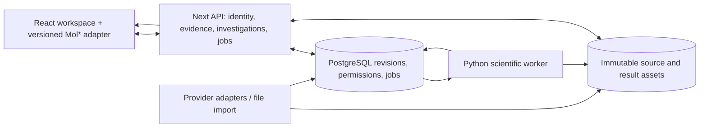

# Signal-1: from target viewing to mechanism investigation

**Proposed, 13 September 2026. No roadmap implementation has begun.** Based on the [repository audit](repository-audit.md) and [primary-source research](research-notes.md).

Build Signal-1 into a **structure-centred mechanism investigation workbench**. Its user should finish with a defensible set of next experiments and an investigation another researcher can reopen—not merely a protein image, an evidence graph or a target score.

The core question is: **“Which perturbations and measurements would distinguish the explanations that matter for this target?”** A researcher names the question, checks biological identity, compares relevant structures and assay outcomes, records contradictory evidence, and selects an experimental panel with controls. The product preserves the exact evidence, calculations and reasoning behind that panel. Later experimental outcomes close the loop.

This preserves the target-to-therapy ambition while making the immediate output something the software can support honestly. Variant effects can inform a mechanistic investigation; they do not establish that a target is therapeutically valid, that a site is druggable, or that a treatment will work.

## Why this is the right level of ambition

The repository's weaknesses are connected. Unverified structure identities undermine comparison; comparison without mapped assay evidence does not establish function; notes without durable state cannot reproduce the investigation; an attractive actionability score conceals these gaps. Solving them together creates a substantially stronger product and a demonstrable technical contribution.

[Open Targets](https://platform-docs.opentargets.org/) already supports general target prioritisation. [ChimeraX](https://www.cgl.ucsf.edu/chimerax/docs/user/tools/matchmaker.html) and Mol* support sophisticated structural analysis, while [MolViewStories](https://molstar.org/mol-view-stories/) supports molecular narratives. Signal-1's proposed benefit is the **connection between a scientific question, correctly mapped evidence, a chosen experiment and a recoverable decision record**. That is a hypothesis about user value which the roadmap tests; no adoption or uniqueness claim is made.

### Three coherent directions

| Direction | User and decision | Strength | Main problem | Recommendation |
|---|---|---|---|---|
| Target portfolio intelligence | Translational team choosing targets for an indication | Close to the original target-to-therapy framing; restores batch dossiers | Competes with mature aggregators; valid prioritisation requires genetics, direction of effect, tissue, modality, safety and organizational context. 3D is often secondary | Keep context and multi-investigation comparison later; do not make another aggregate ranker the initial product |
| **Mechanism investigation and experimental panels** | Molecular/structural researcher deciding which variants, controls and assays to run next | Makes 3D, experimental evidence, prediction and persistence mutually useful; supports bounded scientific evaluation | Requires careful mapping and assay curation; real utility depends on a researcher-backed question | **Recommended product direction** |
| Protein engineering optimization | Protein engineer maximizing a defined property under a batch budget | Clear predictive objective and active-learning loop | A substantial pivot away from target investigation; dense competition; proxy fitness is easily overinterpreted | Reuse its evaluation discipline and selection methods without committing the whole product to optimization |

No numeric opportunity scores are assigned: there is no user research supporting them. Direction two best matches both the original intent and the user's equal priorities of useful 3D interaction, scientific depth and reliable execution.

## First user, first case, and scope

Start with a molecular researcher or computational biologist working with a structural collaborator. They already have a target and an experimental question. Their bottleneck is deciding what evidence is comparable and what small follow-up would clarify it. Do not initially target clinical interpretation, genome-wide screening or autonomous drug discovery.

The recommended feasibility case is **KRAS, with paired abundance and DARPin K55 binding outcomes**. ProteinGym reference metadata contains both assays; a small audit check found both 188-residue references exactly match UniProt `P01116-2`. The current displayed UniProt `P01116-1` is a different, 189-residue isoform. This is a valuable real example of why gene names alone cannot define the investigation. See the [reference check](kras-reference-check.json) and [assay metadata](https://raw.githubusercontent.com/OATML-Markslab/ProteinGym/main/reference_files/DMS_substitutions.csv).

This is a proposed case, not yet an approved assay dataset. Before implementation commits to it, establish overlapping variants, measurement quality, original publication provenance, suitable structures, partner/construct identity and reuse rights. The [original KRAS work](https://pmc.ncbi.nlm.nih.gov/articles/PMC10866706/) already studies mechanistic landscapes; the demonstration must distinguish reproducing known findings from discovering new ones.

The first question could be: **“Which candidate substitutions would help distinguish loss of binding associated with lower abundance from a binding-specific effect at retained abundance?”** These readouts can help discriminate explanations but do not uniquely establish molecular causation. Distal effects may be allosteric, mediated by another factor or assay-specific. A follow-up should include orthogonal measurements and controls chosen by the researcher.

Use EGFR/L858R as an independent identity and coverage regression case: the current first PDB candidate, 1IVO, does not cover residue 858. Do not select a training dataset merely because EGFR is the application's existing default.

## The complete investigation

1. **Frame the question.** Create an investigation with target identity, disease context when relevant, biological system, assay context, competing explanations and an intended decision. Offer a transparent curated example and “use my target/data.” A gene search returns an identity choice with species, accession, isoform and sequence length.
2. **Establish what is comparable.** Import variants or select a residue region. Validate each reference amino acid against the exact sequence. Show a structure coverage matrix, actual construct differences, ligands, chain/assembly and experimental or prediction provenance. Select a comparison whose valid region covers the question, or continue with one structure and an explicit absence.
3. **Inspect the mechanism.** Click a residue in 3D; corresponding sequence positions, assay rows and evidence light up. Select a set of variants in a paired-outcome plot; show their mapped residues. Inspect a region's contacts and available measured effects. Every plotted value identifies the assay and whether it is observed or predicted.
4. **Compare explanations.** Pin evidence under an explicit hypothesis: supporting, conflicting or unresolved. Compare matched structures using declared atom pairs and fit scope. Read caveats next to the result rather than in a distant help page. A claim card identifies what this evidence can and cannot support.
5. **Choose a panel.** State a budget and objective. Select candidates and controls, expose coverage and model applicability, and record manual changes. Early panels are researcher-authored with transparent filters; later evaluated policies can suggest alternatives. Show the tradeoff between predicted effect, uncertainty, diversity, assay feasibility and existing measurements.
6. **Create a reviewable brief.** The brief includes the question, expected observations under each explanation, evidence links, selected variants, controls, assay context, known limitations, and what result would change the decision. Include a frozen scene, comparison report and machine-readable manifest.
7. **Save, reopen, and learn.** Restart the app or use another authorized device and recover the same evidence and scene. Import later results as new observations, compare them to prior predictions, and revise hypotheses without overwriting the old record.

The product should be useful through steps 1–6 before advanced learned mechanisms exist. Learning then improves specific choices inside an already reliable workflow.

## Visual and interaction direction

### Three alternatives

| Direction | Visual language and layout | Tradeoff |
|---|---|---|
| **Warm scientific instrument** | Quiet ivory canvas; charcoal molecular stage; dark green selected states; fine separators; compact sans-serif data labels; restrained serif titles in reports; one persistent workspace | Preserves Signal-1's identity while making dense analysis legible. Recommended |
| Dark structural laboratory | Dark across the entire interface; high-contrast molecular overlays; compact toolbars and synchronized panes | Excellent for sustained molecular manipulation, but long evidence/brief reading becomes less comfortable and colour channels compete |
| Editorial investigation atlas | White pages, generous typography, large figures, annotated evidence sections | Excellent review/export surface; slower for rapid multi-view selection. Use its principles for the brief, not the primary analysis workspace |

Choose the warm instrument for analysis and an editorial brief for review. Avoid a large marketing hero inside the working app, repeated translucent cards, ornamental graph motion and background gradients behind dense tables. Keep visual complexity in the biology.

**Proposed visual specification:** warm off-white `#F6F3EB`, ink `#17261E`, muted text `#526159`, selected green `#126B53`, fine borders `#D8DED7`, charcoal viewport `#101915`. Use a dedicated orange/cyan pair for structures A/B that is separate from evidence-status colours; verify all selected palettes with colour-vision simulations. Keep standard pLDDT legend semantics when that overlay is selected. Never reuse a “good/bad” traffic light to imply clinical significance.

Use a bundled, licensed sans-serif such as IBM Plex Sans at 14–16px for controls and evidence, tabular numerals and a mono face for identifiers; use Fraunces sparingly for investigation/report titles. Supply actual font assets with fallbacks. A 4/8px spacing rhythm, 6–10px corners, minimal shadow and clear column boundaries should replace a stack of oversized cards. All palette, type-size and density choices are proposed and require visual/contrast verification; the current UI could not be inspected in a browser during this audit.

### Main workspace

At a 1440px desktop reference width, use a 56px top bar and a resizable three-column workspace: approximately 240px for the investigation outline and structures, a flexible centre of at least 600px, and 320px for the context inspector. These are starting dimensions, not inflexible breakpoints. The centre combines a molecular stage and a collapsible 180–240px evidence dock. A compact sequence strip remains attached to the stage. The brief is a deliberate review mode, not another tiny sidebar card.

| Area | Always-visible content | Why it matters |
|---|---|---|
| Top bar | Investigation title, exact reference, question summary, save state, job indicator, “Review brief” | Keeps scientific context and work status visible |
| Left outline | Hypotheses, imported assets, structure coverage rows, saved views | Navigates the investigation rather than the provider list |
| Centre stage | 3D view, selected structures/chain identities, active overlay, fit scope and reset controls | Every visual comparison declares what is being compared |
| Sequence strip | Reference coordinates, construct coverage, gaps, variants and current selection | Makes numbering explicit and provides a non-3D selection path |
| Evidence dock | Paired assay plot or variant table; alternate PAE matrix and comparison profile | Links position, observed outcomes and uncertainty without leaving the stage |
| Right inspector | Selected residue/variant identity, measured evidence, prediction applicability, provenance, “Add finding” | Turns a selection into a reasoned record |

This diagram specifies linked state; it is not an implemented UI prototype.

### Interactions that make 3D necessary

| Interaction | Behaviour and scientific meaning | Guardrail |
|---|---|---|
| Hover, click, focus | Hover previews; click selects; explicit Focus frames the selection. Inspector and sequence update together | Ordinary table inspection does not repeatedly move the camera |
| Select residues across views | Sequence range, table multi-select or plot brush creates the same typed selection; multi-chain mappings are shown | No silent mapping to the first chain; unresolved residues remain selectable in sequence but have no invented coordinates |
| Inspect a neighbourhood | Focus a residue; show residues within a declared distance, ligand contacts and interface context | The radius and atom/conformer rules are visible; proximity is not a causal path |
| Overlay or side-by-side comparison | Overlay valid aligned coordinates; optionally split into two panes with a shared transformed frame; independent cameras can be restored | Camera synchronization begins only after a valid correspondence/transform or explicit user choice |
| Change fit scope | Select a domain or a reviewed core; update numerical result and local displacement profile as a new comparison revision | State which atoms were excluded. Do not hide a changing domain by refitting it away |
| Confidence inspection | Switch to per-residue pLDDT or open directional PAE; a matrix selection highlights the corresponding pair of residue regions | Missing values are missing. PAE is not RMSD and pLDDT is not functional confidence |
| Paired-outcome inspection | Brush an abundance/binding region, inspect variant effects and map that set into structure | Show assay-specific axes and uncertainty. Do not subtract arbitrary assay scales to label “binding energy” |
| Hypothesis finding | Capture selection, source records, scene and a written interpretation into a hypothesis | Preserve measured evidence separately from interpretation; give contradictory evidence equal status |
| Experiment panel | Add variants from any view; show controls, existing data, estimated effort if supplied and predicted outcomes by assay | Recommendations stay proposals; no automatic laboratory or paid computation submission |
| Revisit a saved view | Restore camera, representation, selection and exact data assets; compare revisions deliberately | No silent upstream refresh or “latest model” substitution |

No molecular morphing belongs in the first milestone. Later interpolations may be useful illustrations but must be labelled as such; they are not simulated dynamics or a measured transition. Avoid perpetual rotation. Use short, interruptible focus transitions, respect reduced motion, and preserve the user's last camera when unrelated evidence changes.

### States and accessibility are part of the design

Onboarding starts with the research question and exact reference, not a claim that a target is actionable. A curated example visibly states its source and frozen date. Loading progressively exposes identity, then assets, then computations. The user can keep reading saved evidence while a job runs. An upstream failure shows the affected source, retained last-good data if available, and a retry action. It must not lower a biological score.

An invalid reference substitution shows the expected amino acid and the sequence version; it is never autocorrected into a different variant. An incompatible pair shows coverage and the reason comparison is unavailable. An absent mutant leaves one honest structure and mapped sequence evidence. No confidence payload produces a neutral missing-data state, not zeros. Each computation carries queued/running/cancelled/failed/completed status tied to its input revision; an older job cannot replace newer work.

Offer keyboard-accessible sequence and variant tables as complete alternatives to precise 3D picking. Name controls and regions, provide visible focus and text status announcements, use text plus symbols in legends, and avoid colour-only uncertainty. At narrow widths, switch between Structure, Evidence and Brief while retaining selection; do not crush three columns into unreadable fragments. At 200% zoom, controls and evidence must reflow. Screen-reader and keyboard verification belongs in the first milestone, alongside desktop visual review.

## Technical architecture

Keep a modular application, not a premature fleet of services. Next/React remains the UI and authenticated API boundary. Use PostgreSQL for durable investigation and job records, immutable file/object storage for source and computation artifacts, and a Python worker for structural/scientific computation. The same storage interface can use local files in development and an object store in a future hosted pilot. Redis is optional caching, not the source of truth.

Use one versioned contract specification at the boundary, with generated TypeScript/Python types and runtime validation. Organize modules around identity, structure mapping/comparison, evidence, investigations, computation and export. The current “one adapter layer” becomes provider modules with individual contract tests and preserved raw-response metadata. Prefer simple database-backed jobs with leases and idempotency for the pilot; add a separate queue when measured load justifies it.

### Domain records and invariants

| Record | Minimum content / invariant |
|---|---|
| `InvestigationRevision` | Owner/access list, question, context, exact reference IDs, hypothesis revisions, selected panel and schema version. Revision updates use optimistic concurrency |
| `ProteinReference` | Taxon, accession, isoform, sequence version, sequence bytes/hash and source release. Gene symbol is an alias, not its primary key |
| `StructureArtifact` | Source record, exact model/revision, coordinate asset hash/format, experimental or predicted origin, construct sequence, entities, chains, assembly, ligands, resolution/method or prediction confidence metadata |
| `ResidueMap` | Versioned mapping between reference position, construct position, `label_asym_id`/`label_seq_id`, `auth_asym_id`/`auth_seq_id`, insertion code, model and alternate-conformer policy; explicit missing/ambiguous/engineered status. One reference residue may map to several instances |
| `VariantSet` | Reference hash, original input, normalized amino-acid substitutions, validated reference residues, supported mutation class and diagnostics. Use 1-based biological coordinates externally and document internal indexing |
| `AssayDefinition` / `Observation` | Assay ID, construct/reference, organism/cell context, partner/condition, readout/units/direction, processing version, replicate/error information, source row and license. An observed value is never silently replaced by a model value |
| `EvidenceRecord` | Source record and version, claim scope, measured/curated/computed/predicted category, provenance pointer, extraction/normalization method, availability state and caveats |
| `ComparisonResult` | Two artifact hashes, mapping revision, correspondence, fit mask, transform, matched/eligible counts, metrics/units, exclusions, parameter and tool versions |
| `PredictionRun` | Task definition, sequence/assay references, model/checkpoint/code hashes, preprocessing, training/split manifest, applicability limits, predictions and uncertainty method |
| `Hypothesis` / `Finding` | Human claim, predicted observations, evidence links, supporting/conflicting/unknown status, author/revision; derived prose remains editable |
| `ExperimentPanel` | Budget/objective, candidates, controls/replicates, inclusion/exclusion rationale, manual overrides, required readouts and expected distinguishing outcomes |
| `Scene` / `ExportManifest` | Camera, representations, typed selections, immutable asset references, viewer/spec version, linked findings and checksums. Required files and external references are distinguished |

Every displayed residue must resolve through `ProteinReference` and `ResidueMap`. Every number must identify its source or computation, units, applicability and missingness. Every saved result must refer to the inputs that produced it. These invariants are more consequential than a framework choice.

### Structural computation

1. Parse mmCIF/BinaryCIF with a tested parser. Preserve all identifiers; choose assembly and conformer explicitly. Prefer SIFTS mappings when applicable, verify their sequence consistency, and retain a reviewed sequence-alignment fallback for user structures or unsupported cases.
2. Classify a candidate pair: same reference/different construct, validated sequence variant, isoform difference, or unrelated/unsupported. Identify extra mutations, tags, missing segments and partner/ligand differences. Rank candidates by coverage of the question and comparability; expose the reasons.
3. Build correspondence only on mapped residues with the required atoms. For the initial protein comparison, use Cα pairs and rigid least-squares fitting with proper rotation. Require at least three non-collinear pairs for a mathematically defined fit and a separate, more demanding coverage threshold for a useful scientific result. Report both; a mathematically possible fit is not automatically informative.
4. Store the rotation/translation and fit mask. Calculate fit RMSD, retained coverage, per-residue displacement after that fit, and declared local contact/distance changes. Compare within matched regions; label absent residues rather than assigning zero change. Permit domain-level fits and a separate all-matched evaluation mask. Report sensitivity to fit scope.
5. Expose validation metadata and confidence without mixing experimental B-factors with pLDDT. Use PAE for uncertainty in predicted relative placement, not as a measured structural displacement. Do not imply mutation causality when comparing different ligands, crystal contexts, assemblies or unrelated predicted conformations.

Gemmi is a candidate computation library, with [documented superposition and neighbour operations](https://gemmi.readthedocs.io/en/latest/analysis.html). Reuse tested algorithms and compare their results against an independent implementation; the original contribution should be a reliable question-to-result workflow, not a new unvalidated coordinate-fitting routine.

### Viewer and linked-state execution

Pin and bundle Mol* with a narrow application adapter. Keep one plugin instance per active viewport, update its state rather than replacing the container, cancel obsolete loads, and dispose on teardown. Store selections in reference coordinates plus mapping identifiers; translate to Mol* loci at the boundary. Keep hover/camera updates off broad React renders. Use typed arrays and worker-side parsing for large confidence assets; fetch or tile PAE only when needed.

Requests carry investigation revision, job ID and artifact hashes. Results may be stored after a user navigates away but may update the visible workspace only if their input revision still matches. Distinguish “comparison requested,” “completed” and “failed”; only completion creates a numerical finding. A resource failure should leave the prior valid scene available with a visible stale state.

Use [MolViewSpec](https://molstar.org/mol-view-spec-docs/) for a portable scene representation where supported. Retain separate scientific and investigation state. Scene interoperability is an export capability; the complete investigation needs data, computations and interpretations as well.

### Persistence, background jobs and collaboration

An investigation autosaves durable revisions and exposes last-saved status. A snapshot contains exact content hashes, metadata, annotations, selected hypotheses, analysis outputs and scene state. Refreshing provider data creates a new snapshot with a diff. Deletions use a recoverable lifecycle; backup/restore is tested before a hosted pilot.

Jobs have an idempotent input key, lease/heartbeat, bounded retries, cancellation and atomic finalization. A killed worker can restart without duplicating results. Cache keys include reference and provider versions, parameters and parser/model version. A cache outage must not corrupt durable state or silently change the evidence.

Start with a single researcher and explicit share/export. A multi-user pilot adds authenticated membership, project roles and authorized artifact access. Realtime channels publish durable annotation revisions and presence; they cannot bypass database permissions. Cursor presence should identify the selected residue and view, with screen pointers optional. Do not start with a full collaborative CRDT editor; use optimistic revision checks and visible conflicts until actual editing needs justify more complexity.

Arbitrary uploaded structures require bounded file size, format validation and decompression limits. Server-side imports require URL restrictions and content-type validation. Reproducible bundles carry data-license attribution and a clear boundary between redistributable assets and references requiring reacquisition. These are concrete requirements of the proposed imports/sharing workflows.

## Scientific and ML programme

### Define the prediction problem before picking a model

For the first learning module, predict a substitution's **assay-specific abundance or binding readout in the declared KRAS reference and experimental context**. Preserve two outcomes and their uncertainty. Do not train a generic “therapeutic actionability” head. When matched measurements support it, examine candidates with an effect in one readout while retaining the other; this is a pattern for follow-up, not a causal mechanism label.

Three related tasks should be reported separately:

- **Prediction:** estimate held-out measurements or rankings in a stated distribution.
- **Selection:** choose a limited panel that meets the investigator's objective and retains controls and coverage.
- **Mechanistic inference:** distinguish hypotheses using an explicit measurement model and orthogonal evidence.

Success in one does not establish the others.

### Baseline ladder and evidence needed for extra complexity

| Stage | Candidate method | What it tests | Gate |
|---|---|---|---|
| B0 | Random and diversity-only selection; training-set mean; simple substitution/position features with regularized regression | How much benefit comes from a minimal policy/model | Always retained as sanity and cost baselines |
| B1 | Conservation/site-independent model when a suitable MSA exists; published sequence-language-model mutation scores | Does evolutionary sequence information help? | Verify reference offsets, MSA construction and checkpoint exposure |
| B2 | Frozen protein representations with ridge/Bayesian ridge or a small regularized head; one-hot baseline at equal labels | Does task-specific supervision improve the declared assay prediction? | Learning curves and held-out improvement over B0/B1; all fitting/preprocessing inside training folds |
| B3 | B2 plus explicit structure features: accessibility, secondary structure, contact/interface distance, local geometry and missing/confidence masks; separate heads or a small shared multi-output model | Is there incremental structural or paired-assay information? | Ablations on the same eligible variants, structure-only and missingness-only controls, uncertainty and cost report |
| B4 | Published structure-aware comparator such as SaProt; only then a modest custom sequence/structure fusion module | Does a richer representation justify its cost and coverage restrictions? | Beats the best cheaper baseline on the preregistered task; no claim of novelty from modality fusion alone |
| B5 | Reproduce a MoCHI-style mechanistic model where raw paired measurements, error estimates and genetic design support it | Can latent folding/binding traits explain the observations under stated assumptions? | Identifiability, residual diagnostics, held-out backgrounds/replicates, comparison to flexible predictive baselines and original method |

This ladder is an experimental programme, not a commitment to train every model. [Published sequence modelling](https://proceedings.neurips.cc/paper_files/paper/2021/hash/f51338d736f95dd42427296047067694-Abstract.html), [SaProt](https://github.com/westlake-repl/SaProt), and [MoCHI](https://github.com/lehner-lab/MoCHI) supply distinct baselines. Stop at the simplest method that produces useful, reliable results. A negative structure-fusion result is informative and should be retained.

The first milestone can import a verified published baseline with its exact provenance or execute a small supported baseline inference job. It must label that as prior-model output. Training and model comparison start in the subsequent scientific milestone, after assay curation and split design pass review.

### Dataset and evaluation protocol

Freeze the selected ProteinGym release plus original assay identifiers. Use a canonical variant key consisting of reference-sequence hash and normalized substitutions. Verify reference amino acids, duplicates, offsets, missingness, mutation multiplicity and paired-readout overlap. Retain raw measurement values, normalization direction, replicate/error fields and exclusions. Do not turn ProteinGym's convenient threshold into a clinical category. Curated full-study observations, benchmark subsets and original published model inferences must remain distinguishable.

| Claim | Split required | Leakage controls |
|---|---|---|
| Within-assay interpolation on substitutions | Frozen random variant split as a limited baseline | Group identical variants and all assay measurements/replicates for that variant; preprocessing and tuning on train/validation only |
| New positions within the protein | Position-grouped folds | Hold all substitutions at test positions together; for multi-mutants, quarantine records containing held-out positions from training |
| New combinations | Mutation-count and component-aware/background-aware holdouts | Explicitly state whether individual component substitutions were seen; report interpolation and extrapolation separately |
| New assay context or partner | Assay/condition-held-out task | No target assay labels in fitting/calibration; do not describe random paired-row prediction as context transfer |
| Unseen proteins/families | Multiple proteins, sequence-similarity/family clusters held out | Record family clustering threshold and algorithm; audit known pretraining, structural-template and benchmark exposure. KRAS alone cannot support this claim |

For the initial paired-outcome model, hold all outcomes of a test variant out together. If an alternative application predicts binding **given an already measured abundance**, evaluate it as a separate conditional task with that abundance explicitly available at inference; do not mix its results with the all-outcomes-held-out task.

Report Spearman rank correlation, error in meaningful assay units, and objective-specific precision/recall at an experimental budget. For an initial retrospective panel, fix a budget such as 24 candidates before evaluating and show sensitivity at 12 and 48; these are evaluation settings, not universal laboratory capacities. Count controls and repeats in total experimental cost. For paired criteria, use assay-specific prespecified thresholds or a documented measurement model, not a raw score difference. Report joint-outcome error and the fraction of proposed candidates satisfying the defined joint criterion.

Use paired confidence intervals on differences from the best baseline, with resampling units appropriate to the split (positions or variants within a case; proteins/families across cases). Keep one final locked test evaluation. Report small-sample uncertainty rather than using numerous random splits to manufacture confidence. Document checkpoint training exposure as known, likely or unknown; ordinary test holdouts do not remove pretraining contamination.

Assess prediction intervals by empirical coverage and width, stratified by mutation class, region and distance from training examples. Residual ensembles or Bayesian heads are candidates, not guaranteed calibration. If conformal intervals are considered, state exchangeability assumptions and test shift explicitly; do not claim distribution-free guarantees under arbitrary biological shift. Abstain where identity, structure coverage or assay applicability is unsupported.

### Selection policies and the ambitious research contribution

Compare a human-authored panel, random selection, diversity, greedy predicted outcome and uncertainty-aware selection under identical budgets and initial data. For retrospective sequential tests, hide unselected labels, tune the policy on separate development cases, and charge every revealed measurement. Keep controls and repeat measurements fixed or explicitly costed across policies. These tests estimate behavior on the measured library, not on unseen feasible laboratory variants.

The more distinctive research question is: **“Can mapped structural context and calibrated paired-readout predictions help select experiments that distinguish hypotheses more efficiently?”** A first answer may be negative. It needs an explicit hypothesis/measurement model and later expert or prospective assessment. Disagreement between predictors alone is not information gain, and high uncertainty alone is not a valuable experiment. [Published uncertainty benchmarking](https://journals.plos.org/ploscompbiol/article?id=10.1371/journal.pcbi.1012639) reinforces the need to keep greedy and simpler policies.

If the data support a mechanistic latent-trait model, its posterior predictive alternatives can suggest discriminating variants while maintaining diversity and assay feasibility. A new method would require comparison to existing mechanistic inference and experimental design work. Novelty remains unestablished.

## Evaluation of the whole product

Evaluate scientific correctness, usability and prediction separately. For an initial researcher study, propose five to eight intended users performing counterbalanced, matched tasks using their existing tools and Signal-1. Treat this as formative evidence, not population-level proof. Tasks should include a missing-mutant case, an isoform mismatch, conflicting assays and a provider outage. Record completion, mapping errors, unsupported claims, time to a reviewable brief and recovery from saved work. Have an independent domain reviewer assess the brief's evidence traceability and whether the proposed experiment could distinguish the stated explanations.

The system should demonstrate reproducibility by recreating selected case results from a frozen manifest, recovering a saved investigation after restart, and rejecting stale computation results. Performance targets belong in a declared reference workload: two structures, up to roughly 3,000 residues total, 10,000 evidence rows and one lazily opened PAE matrix, tested on a documented integrated-GPU laptop. Proposed budgets are selection feedback under 100ms p95, usable cached investigation within 3s p95, and interactive camera movement at at least 30fps under the supported display mode. Measure and revise these targets; none is a current result.

Run a repeated open/compare/close test and verify viewer instance, worker and GPU-context counts return to baseline. Heap use must plateau after warm-up within an agreed measurement tolerance. Report cold provider latency separately from cached rendering; cache hits and ignored failures must not create misleading speed claims.

## How this changes the seed

| Seed idea | Decision | Why |
|---|---|---|
| Reproducible target/variant investigation | Preserve and strengthen | Make the unit a versioned question, evidence and experimental decision |
| Bounded variant-effect ML module as the entry | Refine | First choose a mechanism question with paired readouts; the predictor is one module within it |
| One protein family or assay subset | Make concrete, conditional | KRAS paired abundance/binding is grounded in inspected metadata and a verified isoform reference; raw curation is still a gate |
| Generic sequence/structure fusion as advanced ML | Defer behind comparisons | Try interpretable structural features, paired outcomes and established mechanistic baselines before bespoke fusion |
| Structural comparisons | Strengthen substantially | Add identity, construct/chain correspondence, fit/evaluation masks and quantitative reports before enabling claims |
| Molecular storytelling | Use as export, not differentiation | Existing MolViewStories/MolViewSpec address much of that surface |
| Live collaboration early | Move later | Durable single-user investigations, correct residue identities and access control come first |
| Global triage score | Reject | No valid target, objective or calibration defines it |
| Automatic WT/mutant and isoform fallbacks | Reject | Unavailability must remain visible rather than being relabelled |
| Persistent experiment briefs | Elevate to the primary output | Restores the best legacy workflow and connects visual reasoning to action |

## Ambitious destination and remaining decisions

The ambitious product supports several curated target/assay settings; interoperable scenes; reproducible structural comparisons; assay-conditioned prediction and interpretable mechanistic fits where justified; candidate-panel comparison under real constraints; and revision of hypotheses after experimental outcomes. Disease, drug, ligand and pathway context explain why a hypothesis matters without becoming an unsupported universal score. Private researcher data and shared review become possible through the same durable, versioned contracts.

The first milestone in the [roadmap](implementation-roadmap.md) deliberately combines the intended visual experience with correct computation and save/reopen/export. It is not a landing page followed by an indefinite science phase.

Only three decisions need substantive review: whether mechanism investigation is the desired product focus; whether the KRAS paired-assay case matches a useful research question or should be replaced by a researcher-backed case; and whether the initial pilot should remain a single-researcher/local workflow before adding authenticated team use. The recommended defaults are yes, conditional KRAS feasibility, and single-researcher first. Budget and hosting decisions can wait until that bounded milestone is approved. No implementation, model training or deployment is authorized by this document itself.
